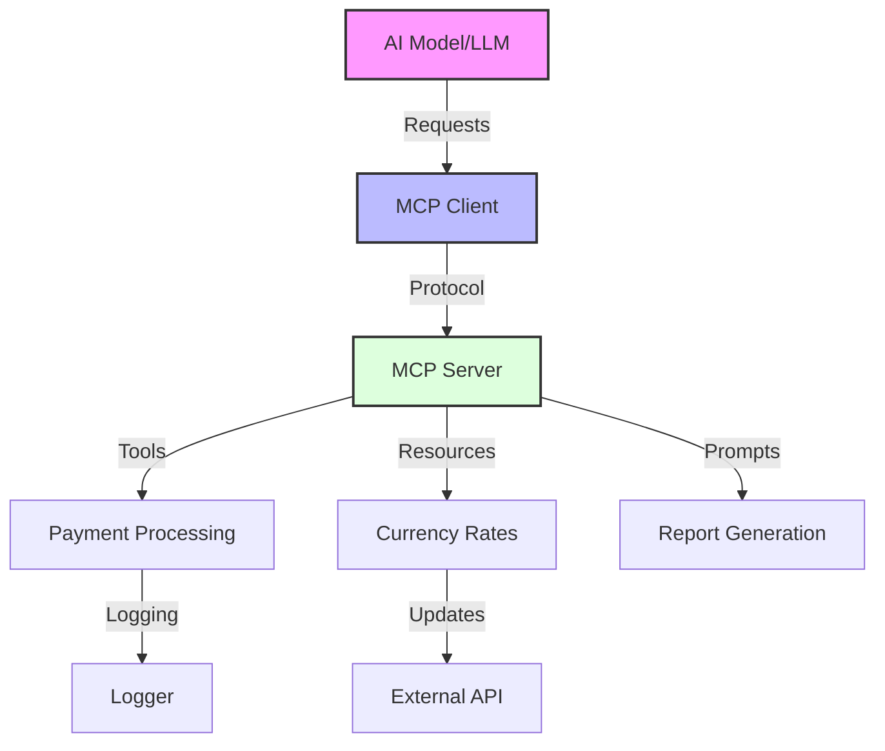
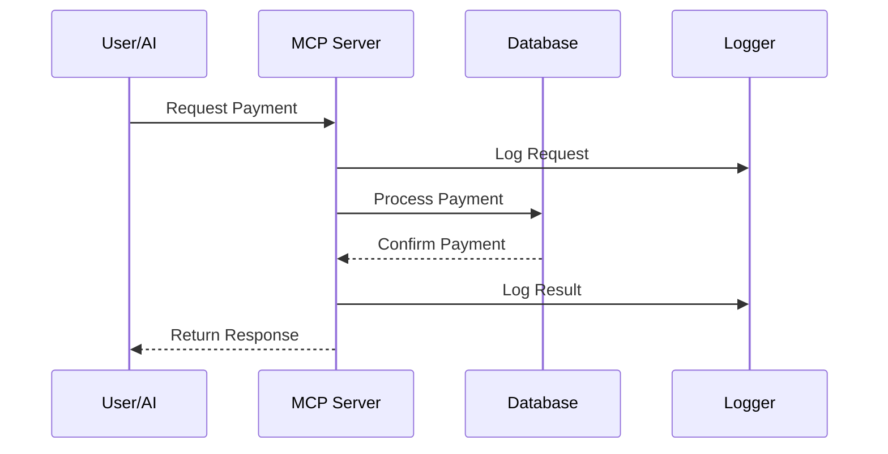

# Building AI-Powered Payment Systems with Model Context Protocol (MCP)

## Introduction

The Model Context Protocol (MCP) framework enables seamless integration between AI models and your application's tools and data.


This repository demonstrates a production-ready payment system implementation that can be used in two ways:

1. **Interactive Development & Testing**: Use the MCP Inspector to interact with and test the payment system directly

2. **AI Integration**: Connect the payment system to AI models for automated processing

## Repository Setup

Clone this repository to explore and run the payment system locally:

```bash
git clone https://github.com/jagreehal/mcp-payment-example
cd mcp-payment-example
```

### Prerequisites

- [Bun](https://bun.sh) runtime environment
- Node.js v18 or higher
- Git

### Local Development

1. Install dependencies:

   ```bash
   bun install
   ```

2. Choose your implementation:

   **Development Mode (Recommended)**

   ```bash
   # Basic implementation with interactive inspector
   npx @modelcontextprotocol/inspector bun src/basic.ts

   # Enhanced implementation with interactive inspector
   npx @modelcontextprotocol/inspector bun src/enhanced.ts
   ```

   **Production Mode**

   ```bash
   # Basic implementation
   bun run start:basic

   # Enhanced implementation
   bun run start:enhanced
   ```

## System Overview

### Architecture



### Data Flow



## Getting Started

```bash
# Installation
git clone https://github.com/jagreehal/mcp-payment-example
cd mcp-payment-example
bun install

# Development Mode with MCP Inspector
npx @modelcontextprotocol/inspector bun src/basic.ts     # Basic implementation
npx @modelcontextprotocol/inspector bun src/enhanced.ts  # Enhanced implementation

# Production Mode
bun run start:basic    # Basic implementation
bun run start:enhanced # Enhanced implementation
```

## Implementation Options

### Basic Implementation (`src/basic.ts`)

The basic implementation provides core payment functionality suitable for learning and testing:

- GBP-only payments
- Standard error handling
- Structured logging
- Essential payment tools:
  - Payment Summary
  - Payment Details
  - Fraud Alert

### Enhanced Implementation (`src/enhanced.ts`)

The enhanced implementation offers production-ready features:

- Multi-currency support
- Advanced fraud detection
- Resource management
- Comprehensive error handling
- Full audit logging
- Extended toolset

## Configuration

### For Interactive Development (MCP Inspector)

No configuration needed! Just run the MCP Inspector commands from the Quick Start section:

```bash
npx @modelcontextprotocol/inspector bun src/basic.ts     # or
npx @modelcontextprotocol/inspector bun src/enhanced.ts
```

### For AI Integration

If you want to connect the payment system to AI models like Claude, you'll need to configure the `claude_desktop_config.json` file:

> 💡 **Tip**: To get your workspace path, run `pwd` in your terminal while in the project directory:
>
> ```bash
> cd mcp-payment-example
> pwd  # This will output your workspace path, e.g., /Users/username/dev/mcp-payment-example
> ```

```json
{
  "mcpServers": {
    "payments-basic": {
      "command": "bun",
      "args": ["run", "{pwd_output_from_above}/src/basic.ts"]
    },
    "payments-enhanced": {
      "command": "bun",
      "args": ["run", "{pwd_output_from_above}/src/enhanced.ts"]
    }
  }
}
```

Configuration options for AI integration:

- `mcpServers`: Object containing named server configurations
- `command`: The command to run the server (e.g., "bun" or "node")
- `args`: Array of arguments including:
  - Script to run with absolute path (e.g., "/Users/username/dev/mcp-payment-example/src/basic.ts")

> 💡 **Important**:
>
> - For development and testing, use the MCP Inspector approach - it's simpler and more interactive
> - Only set up `claude_desktop_config.json` when you need to integrate with AI models
> - Make sure to use absolute paths (starting with /) from your `pwd` output
> - Remove any comments in your actual JSON config file

## Example Usage

### Basic Implementation (`src/basic.ts`)

The basic implementation provides essential payment functionality with a simple set of tools. Start with this if you're new to MCP or need basic payment processing.

```bash
# Run the basic implementation
npx @modelcontextprotocol/inspector bun src/basic.ts
```

#### Available Tools

1. **Payment Summary**

   ```typescript
   // Request
   "Show payment summary for user U123 with details"

   // Response
   User U123 has 3 payments totalling £350.
   ```

2. **Payment Details**

   ```typescript
   // Request
   "Show payments with status pending"

   // Response
   Payments with status 'pending':
   - £200.00 to Bob (3 days ago)
   ```

3. **Fraud Alert**

   ```typescript
   // Request
   "Check for fraud alerts for user U123 with threshold 100"

   // Response
   Alert: Found 2 suspicious payments. Please review for potential fraud.
   ```

### Enhanced Implementation (`src/enhanced.ts`)

The enhanced implementation adds multi-currency support, fraud detection, and advanced reporting. Use this for production-ready payment processing.

```bash
# Run the enhanced implementation
npx @modelcontextprotocol/inspector bun src/enhanced.ts
```

#### Available Tools

1. **Payment Summary (Enhanced)**

   ```typescript
   // Request
   "Show payment summary for user U123 in EUR for the last week"

   // Response
   Payment Summary for U123 (Last Week):
   Total: €432.50
   Number of Transactions: 3
   ```

2. **Add Payment**

   ```typescript
   // Request
   "Add payment of €75 to John for lunch"

   // Response
   Payment added successfully:
   ID: P1234567890
   Amount: €75.00
   Recipient: John
   Status: pending
   ```

3. **Fraud Check**

   ```typescript
   // Request
   "Run detailed fraud check for user U123 with threshold 500"

   // Response
   Fraud Check Report (Detailed):
   Risk Level: Medium
   Suspicious Activities:
   - Large payment: €2000 on 2024-03-10
   - Multiple international transfers detected
   ```

#### Available Resources

1. **Currency Exchange Rates**

   ```typescript
   // Request
   "Get current exchange rates"

   // Response
   Current Exchange Rates:
   GBP: 1.00
   EUR: 1.15
   USD: 1.27
   JPY: 190.5
   Last Updated: 2024-03-10T14:30:00Z
   ```

## Security Features

1. **Input Validation**

   - Currency code validation
   - Transaction limits
   - Payee name sanitisation

2. **Audit Logging**

   ```typescript
   // Structured audit log example
   toolsLogger.info(
     {
       payment: {
         id: 'P123',
         amount: 75.0,
         currency: 'GBP',
         timestamp: '2024-03-10T12:00:00Z',
       },
     },
     'Payment processed successfully',
   );
   ```

3. **Exception Handling**

   ```typescript
   try {
     await processPayment(details);
   } catch (error) {
     logger.error({ error, details }, 'Payment processing failed');
     return createErrorResponse('Unable to process payment');
   }
   ```

## Troubleshooting Guide

Common issues and their solutions:

1. **Connection Issues**

   ```txt
   Error: Failed to create transport
   ```

   ➡️ Verify network connectivity and port availability

2. **Currency Support**

   ```txt
   Error: Unsupported currency: XYZ
   ```

   ➡️ Use supported currencies: GBP, EUR, USD, JPY

3. **Transaction Limits**

   ```txt
   Error: Amount exceeds maximum (£10,000)
   ```

   ➡️ Ensure amount is within authorised limits

## Best Practices

1. **Audit Logging**

   - Implement component-specific loggers
   - Include contextual transaction data
   - Set appropriate logging levels

2. **Exception Management**

   - Implement comprehensive error handling
   - Provide clear error messages
   - Include detailed error context

3. **Security Measures**
   - Validate all inputs thoroughly
   - Implement data sanitisation
   - Enforce proper authentication

## Official Documentation

- [MCP SDK Documentation](https://github.com/modelcontextprotocol/sdk)
- [MCP Inspector Documentation](https://github.com/modelcontextprotocol/inspector)
- [MCP Technical Overview](https://modelcontextprotocol.io/docs/concepts)

## Licence

MIT
